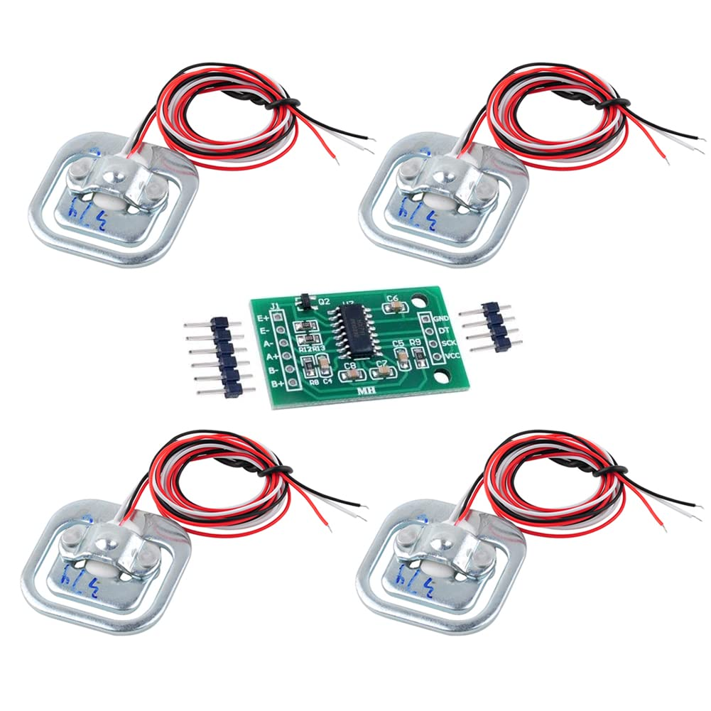
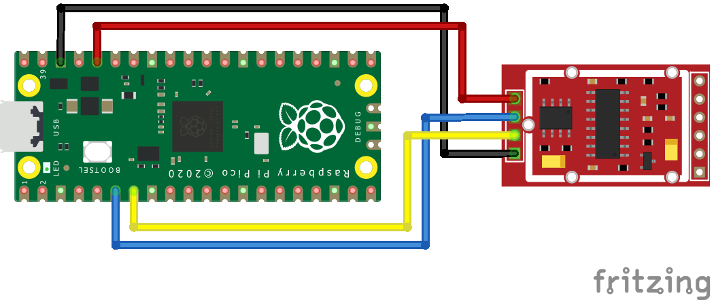
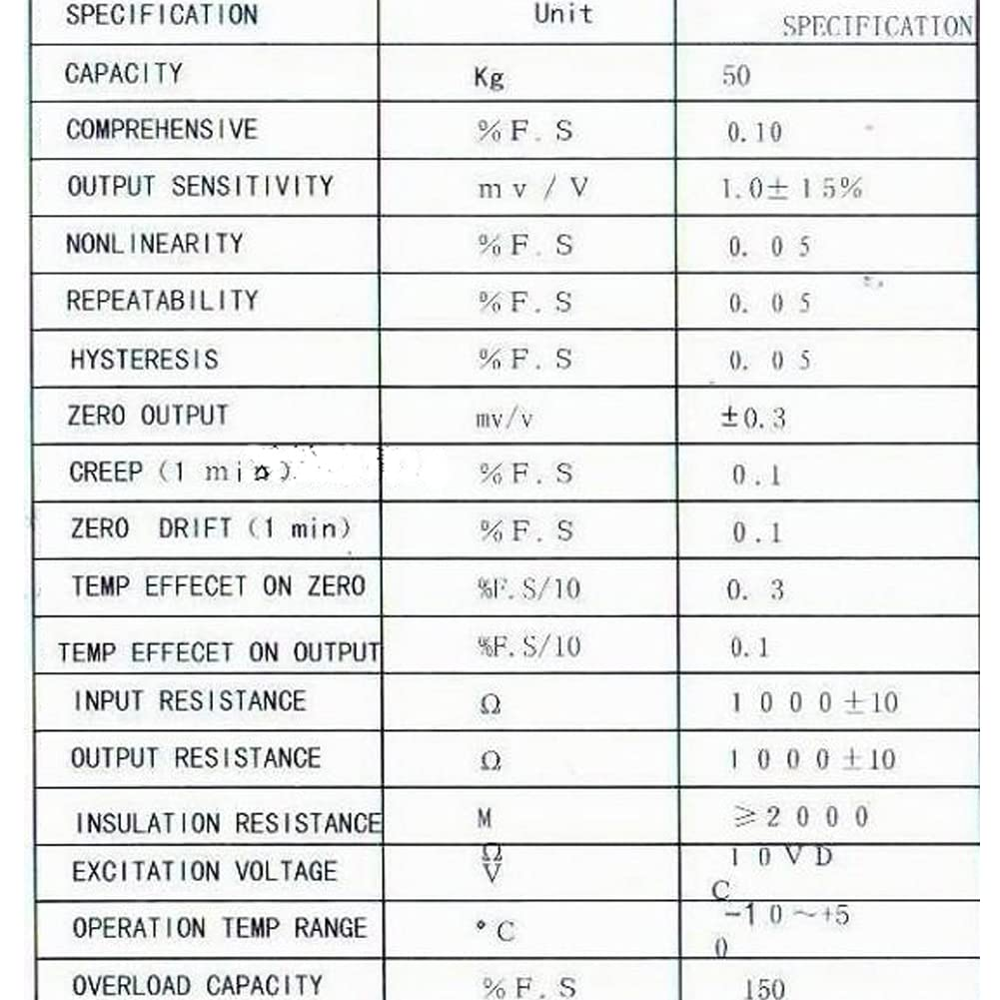

# Raspberry Pi Pico HX711 Load Cell Amplifier Library

Ported to Raspberry Pi Pico, using PIO







## Dev Env Setup

Run in devcontainer

### Pico extension setup

https://github.com/raspberrypi/pico-vscode/blob/main/README.md

May need to import Pico project using Raspberry Pi Pico extension (`Raspberry Pi Pico: Import Pico Project`) to have it download the required tools (ninja, cmake, etc.)

### Serial Monitoring from within VS Code

Need to install `usbipd-win` in Windows to allow USB device to be passed to WSL/devcontainer
https://learn.microsoft.com/en-us/windows/wsl/connect-usb

When you pass access to WSL, you'll lose access from Windows, but you can detach the device from WSL to restore Windows access.

The basic flow is:

1. From windows admin powershell, list connected USB devices and identify the target device's BUSID

    ```
    PowerShell (Admin)

    > usbipd list
    Connected:
    BUSID  VID:PID    DEVICE                                                        STATE
    1-7    046d:c215  USB Input Device                                              Not shared
    1-10   0b05:1939  AURA LED Controller, USB Input Device                         Not shared
    9-2    2e8a:000a  USB Serial Device (COM4), Reset                               Not shared
    10-2   046d:c08b  G502 HERO, USB Input Device, Virtual HID Framework (VHF) ...  Not shared
    10-3   046d:c33e  G915, USB Input Device, Virtual HID Framework (VHF) HID d...  Not shared
    15-1   0458:6006  AUKEY PC-LM1E Camera, AUKEY PC-LM1E Audio                     Not shared
    ```

    Suppose `9-2` is the device we want access to within WSL.

2. Allow the device to be shared

    ```
    PowerShell (Admin)

    > usbipd bind --busid 9-2
    ```

3. Attach the device to WSL

    ```
    PowerShell (Admin)

    > usbipd attach --wsl --busid 9-2
    usbipd: info: Using WSL distribution 'Ubuntu' to attach; the device will be available in all WSL 2 distributions.
    usbipd: info: Using IP address 172.30.224.1 to reach the host.
    ```

4. Verify the device is accessible in WSL

    ```
    WSL

    $ lsusb
    Bus 002 Device 001: ID 1d6b:0003 Linux Foundation 3.0 root hub
    Bus 001 Device 002: ID 2e8a:000a Raspberry Pi Pico
    Bus 001 Device 001: ID 1d6b:0002 Linux Foundation 2.0 root hub
    ```

To detach (from PowerShell): `usbipd detach --busid <busid>`

Add udev rules to allow access to USB devices without root:
- based on instructions here: https://github.com/raspberrypi/pico-vscode/blob/main/README.md
- Copied from [udev/99-picotool.rules](https://github.com/raspberrypi/picotool/blob/master/udev/99-picotool.rules)
- save as /etc/udev/rules.d/99-picotool.rules

In the Ubuntu devcontainer, the Raspberry Pi Pico appeared as `/dev/ttyACM0`
